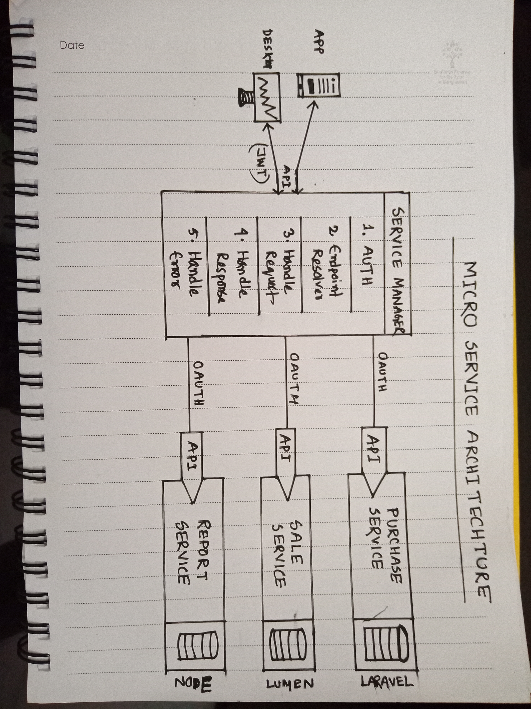

## Microservice Architecture Project Concept

    

This is a microservice based project architecture and demo project concept written in Nuxt Js, laravel, Lumen

### Installation Docs
- **Client:** [Frontend Client](https://laravel.com/docs/routing) platform (Nuxt JS).
- **Service Manager:** [Service Manager](https://laravel.com/docs/container) platform (Laravel).
- **Services:** 
    - [Purchase Service](https://laravel.com/docs/session) platform (Laravel)
    - [Sale Service (Lumen)](https://laravel.com/docs/eloquent) platform (Lumen)

## License

The Laravel framework is open-sourced software licensed under the [MIT license](https://opensource.org/licenses/MIT).
