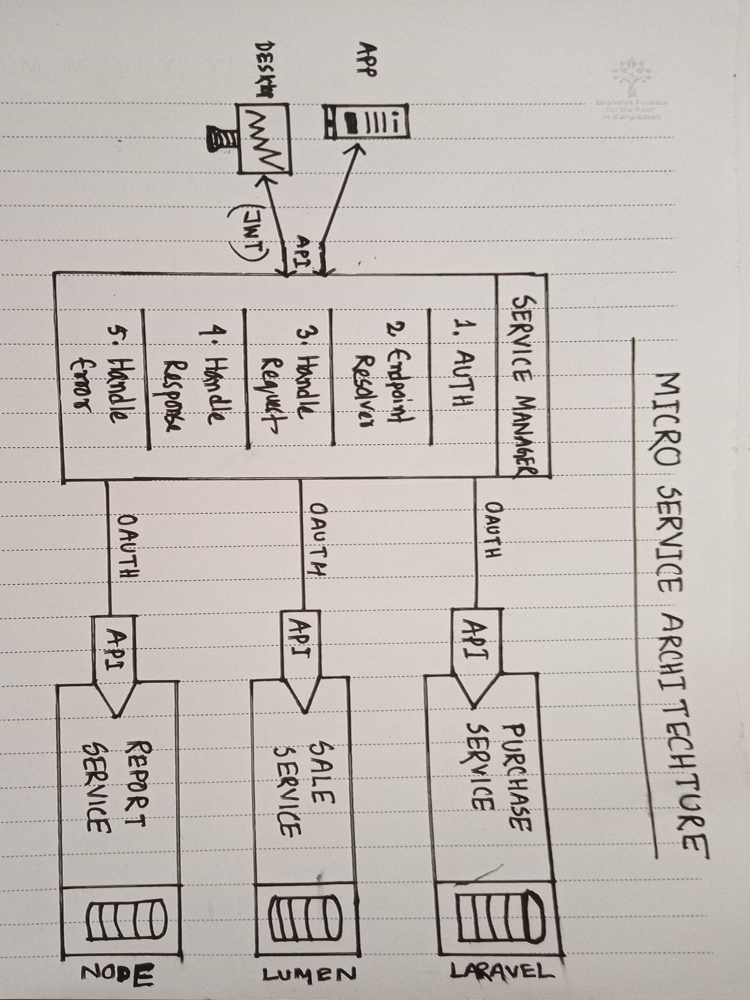

## Microservice Architecture Project Concept

    

This is a microservice based project architecture and demo project concept written in Nuxt Js, laravel, Lumen

### Installation Docs
- **Client:** [Frontend Client](https://github.com/saifur-rahman-hasan/microservice/blob/master/apps/web-app/README.md) platform (Nuxt JS).
- **Service Manager:** [Service Manager](https://github.com/saifur-rahman-hasan/microservice/blob/master/service-manager/README.md) platform (Laravel).
- **Services:** 
    - [Purchase Service](https://github.com/saifur-rahman-hasan/microservice/blob/master/services/purchase-service/README.md) platform (Laravel)
    - [Sale Service (Lumen)](https://github.com/saifur-rahman-hasan/microservice/blob/master/services/sale-service/README.md) platform (Lumen)

## License

The Laravel framework is open-sourced software licensed under the [MIT license](https://opensource.org/licenses/MIT).
